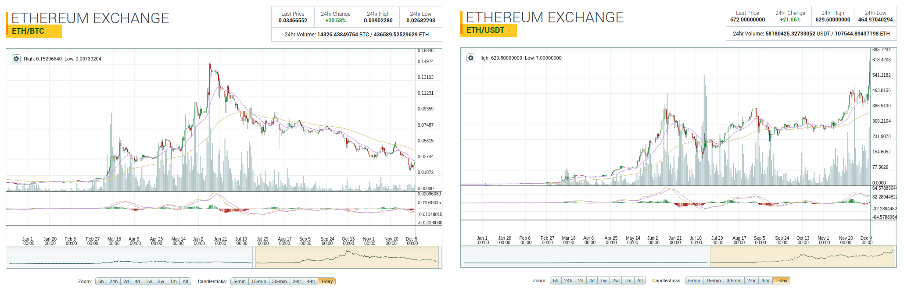
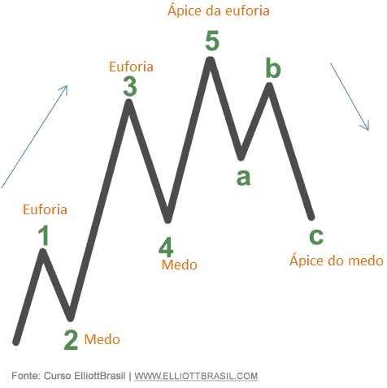

GUIA BÁSICO DE COMO EVOLUIR COMO TRADER
------------------------------------

Basicamente tudo que você precisa saber é que existem algumas técnicas/conceitos de se operar no mercado, são sei se essa é de fato o termo correto, mas as formas de se operar são por:

# Técnicas/Conceitos de Mercado

**1. Análise Gráfica**
> Operar com base nos movimentos do mercado fazendo leitura de candles, tomando como base a mudança de preço e o comportamentos que o preço teve no passado, encontrando suporte, resistencia e figuras que podem determinar para que sentido o mercado pode caminhar.
>
> As notícias não importam muito nesse caso, pois você opera o Price Action. ou seja o movimento do preço ajuda na sua tomada de decisão.
 
**2) Análise Fundamentalista**
> Utiliza Análise Gráfica, mas leva muito em conta as noticias e como elas afetam o preço.
> 
> Você traça perspectivas futuras de altas e de baixas com base nas notícias que acontecem no mercado.

**3) Tape Reading**
> Dependendo do mercado que você opera pode ser uma das técnicas que dão o maior nível de acerto, mas varia de mercado para mercado.
>
> Em Tape Reading você quase não considera os gráficos, talvez um nível de suporte ou resistência e só.
> 
> Basicamente essa técnica você não tenta adivinhar para onde o preço vai, não faz hipoteses gráficas nem nada.
> 
> Você simplesmente considera os últimos 15 minutos de movimentação do mercado por exemplo, não importa o passado e reage sobre o que o mercado demonstra.
> 
> Nesse caso o o volume das ultimas transações ajuda a dimensionar o nivel de agressão que o mercado está sofrendo no momento, e é feita a leitura do livro de ofertas para nele ter noção dos niveis de suporte e resistência, onde pode ser uma zona segura para entrada.
>
> As zonas seguras te dão uma proteção uma vez que podem haver faixas de preços com grandes números de ordens que pode evitar o preço de subir ou descer.
> 
> É comum operar com alavancagem bem alta, pois você passa poucos minutos posicionado, o que reduz o risco ja que sua exposição ao mercado é menor.
> 
> Porém não é facil, até já consegui usar com trade em Bitcons e acertei uns scalps interessantes que me davam 10% em 4 minutos de operação as vezes até menos por exemplo, graças a alavancagem que utilizei (50x), mas a volatilidade da moeda dificulta as vezes a leitura do book e do volume.
>
> É uma técnica que se dominada da muitos ganhos e poucas perdas

Termo do Mercado
----------

### Long / Short - Operar comprado e vendido e Pares ###
> Basicamente algumas exchanges permitem você operar comprado ou vendido.
> 
> Comprado é o fluxo normal, se o gráfico sobe você lucra com a alta, se cai você perde com a queda.
> Quando você opera vendido você básicamente opera com o gráfico de cabeça para baixo, ou seja, você lucra na queda e perde na alta.
> 
> Como isso acontece?
>
> Exemplo em Forex: EURUSD - Euro / Dólar
> Você está comparando a Valorização do Euro perante o Dólar
> 
> Se vc opera comprado... vc ta adiquirindo Euro... e se o Euro valoriza perante o Dólar o gráfico sobe... vc lucra na alta
> Se vc opera vendido... vc ta adiquirindo Dólar.... se o Euro desvaloriza perante o dólar (ou seja o gráfico cai)... e vc tem dólar na mão,  vc lucra na queda
> 
> A mesma coisa é: 
>
> BTC/USD, ETH/BTC, XRP/USD
> 
> Se o BTC sobe muito como ta acontecendo agora, e as outras moedas não valorizam na mesma proporção, o gráfico delas cai...
> 
> Só observar a diferença do grafico da ETH de Jan à Dez deste ano (2017) da ETH/USD e ETH/BTC na Poloniex.... 
>
> 
> 
> O BTC valorizou demais... o gráfico da ETH ta uma queda triste nesse momento (Dez/2017) (... mas se olhar em relação ao dólar...  esse mes de dezembro ela rompeu o topo histórico.
> 
> Para entender mais sobre operar comprado e vendido veja o vídeo abaixo. 
>
> https://www.youtube.com/watch?v=46uPKUq0Yx4
>

### Alavancagem ###

> Um termo importante pra se conhecer também é a **alavancagem**, nem toda a exchange tem, a poloniex permite se não me engano 2,5x... eu uso uma que permite alavancar em até 100x:
> 
> Alavancagem é basicamente você operar com um capital maior do que o vocÊ tem, algumas exchanges permitem isso.
>
> Ou seja... se eu entrar com 10 dolares na operação, multiplicado por 100x... eu opero com 1.000 dólares, isso faz o mercado ficar mais sensivel, ou seja.
> 
> Uma alta de 1% alavancado em 100x da 100% de lucro.
> Uma alta de 30% alavancado em 3x da 90% de lucro.
> 
> Porém o risco aumenta consideravelmente e a chance de perder tudo que foi investido são muito maiores se não tem cuidado nas entradas, sem falar no psicológico de ver o preço alavancado ir contra você, ver um movimento simples contra mostrar te mostrar 30% de perda, pode fazer sair de uma operação de lucro por puro medo e despreparo, precisa ter uma cabeça muito boa e estar com análise afiada para usar alavancagens maiores com prudencia, porque o risco de perda aumenta consideravelmente.

### Tipos de Traders ###

> Dai tem os tipos de posicionamentos day trade, scalper, holder, swing trade etc... que você podem aprender com mais calma depois.
> 
> Mas é basicamente o tempo que trader se expõem ao mercado e as tomadas de decisões dele.
> Tem traders que ficam posicionados por poucos segundos, as vezes horas, dias, até meses, isso vai muito de cada um, mas vale apena pensar que tipo de trader você quer ser.
> 
> Mas ouvi dizer que se alguém está começando é sempre  bom operar graficos maiores, em alguns videos sobre scalp já vi comentarios do tipo: "O cara é trader inexperiente, e quer operar em gráfico de minuto é como o cara tirar hoje a carta de motorista e querer pilotar um formula 1."

----------

# **CANAIS DO YOUTUBE:**  
## (Referências para estudos) #
 

### **Bitcoin e Criptomoedas** ###
Os canais abaixo são de pessoas que trabalham com foco em bitcoin e criptomoedas

> 
> #### **[ALESSANDRO DIAS](https://www.youtube.com/channel/UCjId-nDslP6E0KMmr-GoDuw)**  ####
> ***( Análise Gráfica )*** 
> 
> 
> 
> Um dos trades que mais gosto de ver, o cara tem um conhecimento muito bom e sabe como fazer dinheiro com Bitcoin, ele tem um perfil mais conservador, diferente de mim que sou mais agressivo, porém gosto muito do conhecimento que ele passa e dos vídeos que ele produz.
> 
> Os vídeos mais importantes estão nessa Playlist que ele montou com o nome de **[Gerenciamento de Risco](https://www.youtube.com/playlist?list=PLj-6o2Vsw5Uam1KtYUFJN5xNMHfhScR4U)**:
> 
> 
> Essa playlist fala mais sobre tomadas de decisões, como evitar perdas maiores que o esperado, como lucrar na queda (conceito de entrar comprado e vendido) recomendo demais também.   
> Dois vídeos importantes sobre Análise Gráfica que ele publicou e não encontrei nas playlists são esses:
> 
>  - **[Padrão de Continuidade](https://www.youtube.com/watch?v=rRzEBeXXoqM)**  
>  - **[Padrão de Reversão](https://www.youtube.com/watch?v=V3qnwVzSX-E)** 
>  
>  		
> 
> Com os vídeos dele melhorei muito meu psicológico, aprendi que é normal ter perdas, e ter paciência, não querer compensar uma perda com um risco maior e confiar na sua estratégia, quando estiver posicionado só sai da operação se bater no seu stop ou no seu alvo (se usar um alvo) mas o importante é gerenciar o quanto perde.
> 
> Ai tem todas as Playlists dele:
> https://www.youtube.com/user/diaspcf/playlists

************************
> 
> #### **[CRIPTOMOEDA FÁCIL](https://www.youtube.com/channel/UCak-HWmXEqeC3KOjTN9Fr-Q)**  ####
> ***( Análise Gráfica )***
> 
> 
> Um excelente canal que de tempos em tempos posta análise gráficas de varias Criptomoedas que estão em evidência no mercado.
> É possivel aprender muitos conceitos com as análises postadas no canal, ele não é focado em tutoriais, mas tem alguns vídeos bem interessantes focados em ensinar análise técnica, indicadores entre outras coisas mais.
> 
> Eles possuem uma playlist que é um curso sobre Análises Gráficas
> https://www.youtube.com/playlist?list=PLxxlOQ5510A3_Tiv45wgK4uV8t_pB3JNP
> 
> A ordem correta é do último para o primeiro.
> 
> Um vídeo que vale destacar caso não conheça é a importância do Fibonacci para encontrar suportes e resistencias em uma tendencia.
> https://www.youtube.com/watch?v=lNA05OB5DJg
> 
> Esse vídeo da uma noção bem interessante da importância do Fibonacci para entradas e saidas (alvos), (mais abaixo no canal do André Moraes tem uma palestra online de 2 horas sobre Fibonacci se quiser aprender mais afundo)

************************

### **Ações, bolsa de valores, índices, dólar...** ###
Por muito tempo fui resistente a ver canais que trabalhavam com mercado diferente, ferramentas diferentes e tudo mais, porém a quantidade de conteúdo que você encontra é absurdamente maior e de alta qualidade, e no fim, apesar de algumas coisas bobas serem diferentes no fundo conceitualmente é a mesma coisa.

E no fim são os canais que mais estão me agregando conteúdo de qualidade de forma mais aprofundada.

Muitos dos caras que estão nessa lista tem mais de 10 anos de experiência no mercado financeiro.

Algumas diferenças são operar na abertura e fechamento de mercado que não existe isso em criptomoedas, é 24 horas por dia... no caso de tape reading em criptomoedas já operamos em "tela cega", o que pra eles ainda não é uma realidade mas parece que será no futuro, basicamente hoje no mercado Brasileiro você consegue saber a movimentação dos "grandes players", exemplo, aparece junto do book que o Bradesco por exemplo está comprando dólares e tal, e você pode usar a movimentação desses grandes investidores para saber o que pode estar acontecendo com o mercado, se de repente ele pode subir ou cair, em criptomoedas ja não tem isso.

> 
> #### **[ANDRÉ MORAIS](https://www.youtube.com/channel/UCqsq57uOHDfJzoAV_4JkOew)**  ####
> ***( Análise Gráfica )***
> 
> 
> Horas e horas de conteúdo da mais alta qualidade de um cara entende MUITO de mercado.
> 
> Além de ser um material rico de informações (tem vários videos que são longos com mais de uma hora, e são recheado de informações importantes)
> 
> Recomendo demais alguns vídeos:
> 
>  - **[Curso Básico de Análise Técnica](https://www.youtube.com/playlist?list=PLw0wwQUldr2LVtEop45dM59fyUfIxMb4-)**  
>  - **[Curso Avançado de Análise Técnica - Se afastando da Manada:](https://www.youtube.com/playlist?list=PLw0wwQUldr2K7jFVq7UX3I72MoLk9u590)** 
>  - [**FIBONACCI: SAIBA COMO PREVER OS NÍVEIS DE PREÇO NO GRÁFICO** (2 horas)](https://www.youtube.com/watch?v=8-qbG5ZeolQ)
>  

----------

> 
> #### **[Mago Finance](https://www.youtube.com/user/TradeAoVivo)**  ####
> ***( Análise Gráfica, foco em Scalping )*** 
> 
> 
> Um dos conteúdos mais interessantes em termos de scalping, com ele aprendi a importância de se preocupar com Alinhamentos Fractais, que é basicamente você esperar que ao menos 3 tempos gráficos diferentes apontem o mesmo movimento, clique no vídeo abaixo de 59 segundos apenas para ver o alinhamento em ação.
> 
> 
> Ele aborda isso em vários vídeos além de outras técnicas, tem muitos vídeos longos e de qualidade.
> 
> 
> Recomendo demais
> 
>  - **[SCALP: QUAIS OS MELHORES PONTOS DE ENTRADA PARA UM TRADE DE SCALP](https://www.youtube.com/watch?v=WWCE3_50UkM)** 
>  - **[STOP: SAIBA COMO UTILIZAR DA MANEIRA CORRETA](https://www.youtube.com/watch?v=03u0lZcr5r4)** 
>  - **[REDUZA O RISCO DE SEUS TRADES COM ESSA TÉCNICA SIMPLES](https://www.youtube.com/watch?v=Db9sCIJy-SY)** 
>   
> 
> Como eu disse ele possui vários videos longos de palestra e hangouts, ensinando MUITA COISA, mas um que achei muito interessante do ponto de vista de aprender que trade é uma tarefa que leva tempo para dominar que é você vai tomar muito tapa na cara antes de evoluir e fazer excelentes profits é esse:
> 
>  - **[QUEM É FABRÍCIO MACIEL, O ALUNO QUE FAZ MAIS DE R$10.000 POR DIA](https://www.youtube.com/watch?v=dUJmxnWXdsQ)** 
>  
>  		
> 
> Assistir esse vídeo me mostrou o quanto é normal perder e as vezes até quebrar, o negócio e não desistir e procurar evoluir sempre.

----------
> 
> #### **[Ports Trader](https://www.youtube.com/channel/UCMzDqmbWhAnRr8-Va8ZsSNw)**  ####
> ***( Análise Gráfica )*** 
> 
> 
> 
> Além de um excelente conteúdo o cara ainda possui um pacote de cursos pago, não é barato, mas pelos vídeos você vê que o cara tem um ótimo conhecimento.
> 
> Não vejo tanto quanto os anteriores pois são vídeos superficiais, estou no foco de vídeos mais longos, porém todo o vídeo curto acaba sendo interessante, o curso dele eu compraria, você vê muito conhecimento no que ele fala.
> Os vídeos dele são mais curtos mas customam ser excelentes.

----------
> 
> #### **[Scalper Trader](https://www.youtube.com/channel/UCjOodtnCpr2O2zmJWFxt75Q)**  ####
> ***( Tape Reading )*** 
> 
> 
> Esse canal tem foco total em Tape Reading, uma técnica que da acertos absurdos em alguns mercados, tape reading sozinho é dificil fazer funcionar no mercado de bitcoins pela alta volatilidade, mas uso muito em conjunto com análise gráfica e melhora potencialmente a segurança nas entradas e operações com alta alavancagem.
> 
> Muito bom ter esse conhecimento em conjunto com análise gráfica.
> 
> Tem várias Playlists organizando o conteúdo em categorias.
> https://www.youtube.com/user/scalpertrader/playlists
> 
> Destaque para:
>
>  - **[Curso completo gratuito de Tape Reading](https://www.youtube.com/playlist?list=PL8AHJj3bYn7H930Ehd1vJBNfbpDUKWSLd)**  
>  - **[Curso Gratuito | Como unir Price Action + Análise de Volume + Tape Reading](https://www.youtube.com/playlist?list=PL8AHJj3bYn7GcqZkPfbWFiHG9nF2u5xWv)**
>  
>  		

 
----------

> 
> #### **[Vida de Trader (Atom S/A)](https://www.youtube.com/channel/UCTYqr2r-mPW4cQshVQXDJ3A)**  ####
> ***( Tape Reading )*** 
> 
> 
> Esse é um canal de uma corretora que tem cursos, e permite você operar com o capital dela, eles não consideram operar com criptomoedas, mas o curso do Joaquim Paifer, que é o dono da Atom, é algo que me fez chamar atenção ao Tape Reading.
> 
> O canal em si não é tão enriquecedor quanto os anteriores em termos de ensinamentos, porém a forma deles trabalharem é que chama atenção.
> Mas tem vídeos deles operando na pratica, hangouts e tudo mais.
> 
> A simplicidade da estratégia é fenomenal, porém o conteúdo dele que vi foi de um curso de como ganhar 500 reias por dia...
> 
> Basicamente ele operava com 16 mil reais em contratos e fazia lucros de 500 reais/dia em 2 operações (R$250 cada) que cada uma durava as vezes menos de um minuto.
> 
> Como falei repliquei isso com alavancagem, e realmente funciona.
> 
> Aqui ele explica a estratégia dele (É importante conhecer o conceito de [comprado e vendido explicado no vídeo do Alessandro Dias](https://www.youtube.com/watch?v=46uPKUq0Yx4))
> 
> [Explicação conceitual da estratégia do Joaquim Paifer](https://www.youtube.com/watch?v=DOI7awLL89s)
> 
> No curso dele (não vale tanto apena do ponto de vista de horas de material, não é tão diferente do workshop que ta gratuito no youtube) tem ele fazendo 2 operações por dia na pratica e lucrando com os movimentos curtos.
> 
> Além dos relatórios de acertos das outras operações dele do dia que é absurdamente alto. Tem vários casos em que 1 dia de operação ele fez 12 trades com 1 perda, 10 com uma perda e um zero a zero, teve caso até de 10 trades 10 acertos.
> 
> Como falei vale apena pesquisar e aprender tape reading pois o nivel de assertividade é enorme, e usado em conjunto com análise gráfica ainda mais para pegar a extremidade de um suporte ou uma resistência, precisando assim de um stop bem curto e com grande possibilidade do preço ir ao seu favor.

# **Referências de Leituras** 

 
## **Apenas Português**

Ainda não tenho muitas referências de artigos em português, mas vale apena dar uma olhada nesse sobre Ondas Elliots

 - [10 Segredos Sobre Ondas De Elliott Que Todos Os Traders Deveriam
   Saber: Um Guia Indispensável...](http://www.elliottbrasil.com/análise-tecnica/segredos-sobre-teoria-das-ondas-de-elliott/)
   
   

 
## **Apenas Inglês**

Alguns links de artigos que li de trade, se sua leitura for intermediária recomendo pegar alguma extensão como essa do [Google Tradutor](https://chrome.google.com/webstore/detail/google-translate/aapbdbdomjkkjkaonfhkkikfgjllcleb?hl=pt-BR) para auxiliar a ler algumas partes do conteúdo caso tenha dificuldade de lembrar ou traduzir alguns termos em específico, é bom que ajuda a evoluir a leitura.

> ## **Série de artigos da Pumper Stick** (sobre criptomoedas) ##
> 
> Essa série abriu minha mente sobre como as pessoas perdem dinheiro e como o mercado funciona de fato:
> 
> Eles abordam desde de épocas em que uma moeda sempre se valoriza com frequência e o mesmo padrão, que os maiores profites estão naqueles caras que operam poucas vezes e não o tempo todo (isso no caso de operar unicamente em cima de análises, e depende do capital também, em fim...), até como o mercado é cruel, e quando você entende isso entende que os gráficos são muito mais que números, mas emoções.
> 
> 

> Nesse ponto as Ondas de Elliots dão um grande exemplo nisso:
> 
> Quando você passa a enxergar isso e ver do ponto de vista de quem é uma baleia investindo, você passa a entender que esses padrões de repetição funcionam porque sempre tem pessoas cometendo os mesmo erros, compram no ápice da euforia (**Perna 5**), e tem uma grande perda com uma queda (**Perna A**)... que no caso é um pullback de queda em um tempo gráfico maior, só da a chance dos grandes investidores lucrarem novamente antes de puxar mais uma grande queda (enquanto os pequenos e inexperientes após perderem com a primeira queda - **Perna A** - acreditam que podem recuperar nessa alta que pode durar dias - **Perna B** - , sem imaginar que vem outra queda na sequencia - **Perna C**)
> 
> **Da uma lida na série completa, garanto que não gera arrependimentos, leia nessa sequencia**
> 
>  1. [The quickest way to make money with altcoins, is to understand how people lose money](http://pumperspicks.com/the-quickest-way-to-make-money-with-altcoins-is-to-understand-how-people-lose-money/)
>  2. [Ensure that you aren’t reading from the same playbook as the typical and unprofitable, novice trader](http://pumperspicks.com/ensure-that-you-arent-reading-from-the-same-playbook-as-the-typical-and-unprofitable-novice-trader/)
>  3. [When trading altcoins, sell resistance is the gate-keeper to profit](http://pumperspicks.com/trading-altcoins-sell-resistance-gate-keeper-profit/)
>  4. [The ultimate altcoin buying strategy](http://pumperspicks.com/ultimate-altcoin-buying-strategy/)
>

----------

> ## **Série de 35 artigos da Learn to Trade The Market** ##
> Está série é focada em Forex, mas é abarrotada de conteúdo de alta qualidade que você pode utilizar em qualquer mercado, são alguns dos melhores artigos que vi, um dos que mais gosto é:
> 
> **[Trade Forex como um Sniper, não como uma Metralhadora](http://www.learntotradethemarket.com/forex-articles/trading-forex-like-a-sniper-not-a-machine-gunner)**
> 
> 
> Bem basicamente ele aborda que assim como um atirador de elite precisa considerar a distancia do tiro, a queda da bala, velocidade do vento ou outras condições climáticas entre varias coisas, um trader de sucesso precisa saber esperar o mercado entrar em uma boa condição para entrar também.
> 
> Se você sair varrendo o site verá uma cacetada de artigos que são muito enriquecedores, um melhor que o outro, inclusive estratégias e tudo mais.
> 
> Ainda não li todos, alguns estão para eu ler quando tiver com tempo, mas segue uma porrada de artigos que me interessaram enquanto garimpava o site. Análise com calma titulo a titulo e veja o que mais te interessa:
> 
> Todo o conteúdo que li desse site foi bem escrito e repleto de conhecimento
> 
>  1. [Top 10 Forex Trading Tips for Beginners](http://www.learntotradethemarket.com/forex-articles/top-10-forex-trading-tips-for-beginners)
>  2. [Profitable Traders Do Nothing 99% Of the Time](http://www.learntotradethemarket.com/forex-articles/profitable-traders-nothing-99-percent-time)
>  3. [How To Draw Support and Resistance Levels Like A Professional](http://www.learntotradethemarket.com/forex-trading-strategies/how-to-draw-support-and-resistance-levels)
>  4. [Forex Pin Bar Method – Trading Pin Bars From Key Levels](http://www.learntotradethemarket.com/forex-trading-strategies/forex-pin-bar-method-s-and-r)
>  5. [How To Place A Stop Loss & Profit Target Like A Professional ](http://www.learntotradethemarket.com/forex-trading-strategies/how-to-place-stop-loss-profit-target-forex-trading)
>  6. [Inside Bar Forex Trading Strategy](http://www.learntotradethemarket.com/forex-trading-strategies/inside-bar-forex-strateg)
>  7. [How To Trade Key Chart Levels in Forex](http://www.learntotradethemarket.com/forex-trading-strategies/how-i-trade-forex-from-key-chart-levels)
>  8. [The ‘False Break’ Trading Strategy](http://www.learntotradethemarket.com/forex-trading-strategies/trading-false-break-strategy-forex-trading)
>  9. [Why You Should Take the Profits and Run!](http://www.learntotradethemarket.com/forex-trading-strategies/why-take-profit-trading?hilite=%22like%22)
>  10. [The Psychology of Trade Profit Targets](http://www.learntotradethemarket.com/forex-articles/psychology-of-trade-profit-targets?hilite=%22like%22)
>  11. [ How To Anticipate Your Next Trade](http://www.learntotradethemarket.com/forex-trading-strategies/how-to-anticipate-your-next-trade?hilite=%22like%22)
>  12. [ The Most Dangerous Time to Trade](http://www.learntotradethemarket.com/forex-articles/the-most-dangerous-time-to-trade?hilite=%22like%22)
>  13. [ How I Plan My Trades](http://www.learntotradethemarket.com/forex-articles/how-i-plan-my-trades?hilite=%22like%22)
>  14. [ Can You Really Beat the Market? Here Are 5 Tips that Will Give You an Advantage](http://www.learntotradethemarket.com/forex-articles/can-you-really-beat-the-market?hilite=%22like%22)
>  15. [ 12 Trading Mantras from Trading Legend Mark Douglas](http://www.learntotradethemarket.com/forex-articles/12-trading-mantras-from-trading-legend-mark-douglas?hilite=%22like%22)
>  16. [ What Lions Can Teach Us About Professional Trading](http://www.learntotradethemarket.com/forex-articles/what-lions-can-teach-us-about-professional-trading?hilite=%22like%22)
>  17. [ How to Trade Successfully with a Small Trading Account](http://www.learntotradethemarket.com/forex-articles/how-to-trade-successfully-with-a-small-trading-account?hilite=%22like%22)
>  18. [ How to Finally Start Making Money Forex Trading](http://www.learntotradethemarket.com/forex-articles/how-to-finally-start-making-money-forex-trading?hilite=%22like%22)
>  19. [ The Psychology of Why You Give Back Your Trading Profits](http://www.learntotradethemarket.com/forex-articles/psychology-of-why-you-give-back-your-trading-profits?hilite=%22like%22)
>  20. [ My 4 Secrets For Making The Perfect Trade Entry](http://www.learntotradethemarket.com/forex-trading-strategies/4-tips-for-making-better-trade-entries)
>  21. [ The Ultimate Forex Trade Entry ‘Trick’ You Need To Master](http://www.learntotradethemarket.com/forex-trading-strategies/ultimate-forex-trade-entry-trick)
>  22. [ How to Filter Good & Bad Price Action Entry Signals](http://www.learntotradethemarket.com/forex-trading-strategies/how-to-filter-price-action-trading-signals)
>  23. [ Case Study – Random Entry & Risk Reward in Forex Trading](http://www.learntotradethemarket.com/forex-articles/forex-trading-random-entry-and-risk-reward)
>  24. [ The Market is Speaking, But Are You Listening?](http://www.learntotradethemarket.com/forex-articles/market-speaking-listening)
>  25. [ The Power of The Pull Back Trading Strategy](http://www.learntotradethemarket.com/forex-trading-strategies/pull-back-trading-strategy)
>  26. [ How to Not Lose Your ‘Shirt’ Trading](http://www.learntotradethemarket.com/forex-articles/how-to-not-lose-your-shirt-trading)
>  27. [ What Is A Fakey Pattern and How Do You Trade It?](http://www.learntotradethemarket.com/forex-trading-strategies/what-is-fakey-pattern)
>  28. [ What Are The Best Chart Time Frames To Trade ?](http://www.learntotradethemarket.com/forex-trading-strategies/best-chart-time-frames-to-trade)
>  29. [ ‘The Holy Grail Of Forex Trading Strategies’ – Daily Chart Time frames ](http://www.learntotradethemarket.com/forex-trading-strategies/holy-grail-forex-trading-strategy-daily-chart-price-action)
>  30. [ Why Trading The Daily Charts Will Improve Your Trading Results](http://www.learntotradethemarket.com/forex-trading-strategies/why-trading-the-daily-charts-will-improve-your-trading-results)
>  31. [ Pyramid Trading Strategy – How To Turn Small Trades into Huge Trades ](http://www.learntotradethemarket.com/forex-trading-strategies/pyramid-money-management-strategy)
>  32. [ Simplify Your Trading in 3 Easy Steps](http://www.learntotradethemarket.com/forex-currency-trading-blog/simplify-your-trading-in-3-easy-steps)
>  33. [ Trade Less, Profit More](http://www.learntotradethemarket.com/forex-currency-trading-blog/trade-less-profit-more?hilite=%22partial%22)
>  34. [ How Price Action Trading Changed My Life and How it Can Change Yours Too ](http://www.learntotradethemarket.com/nial-fullers-blog/how-price-action-trading-changed-my-life)
>  